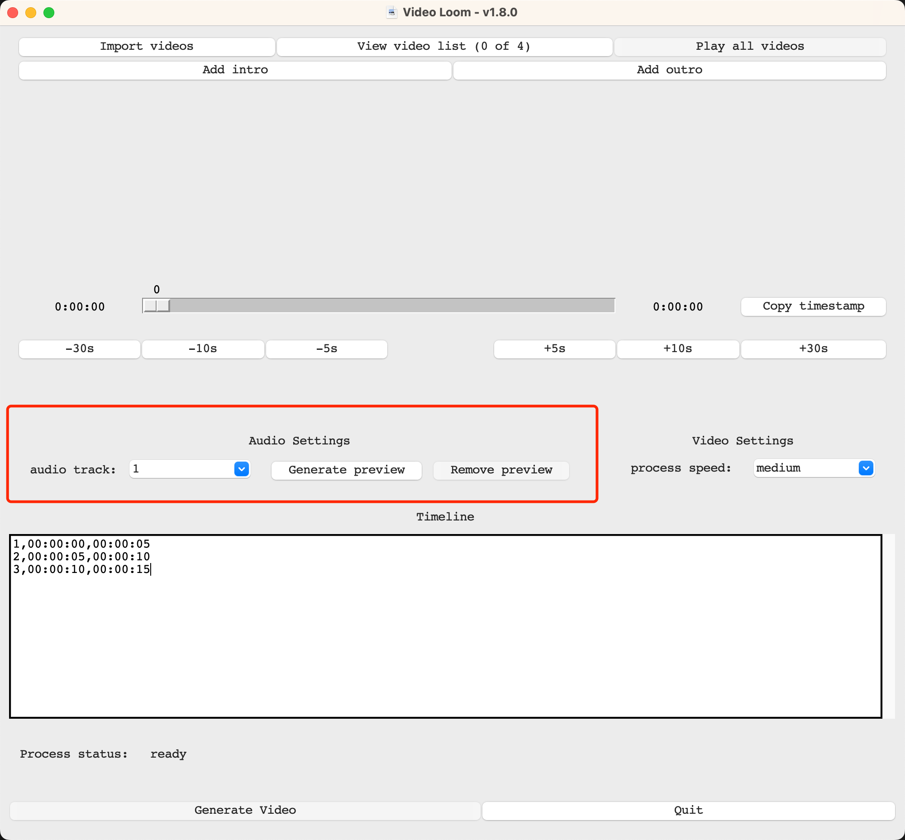
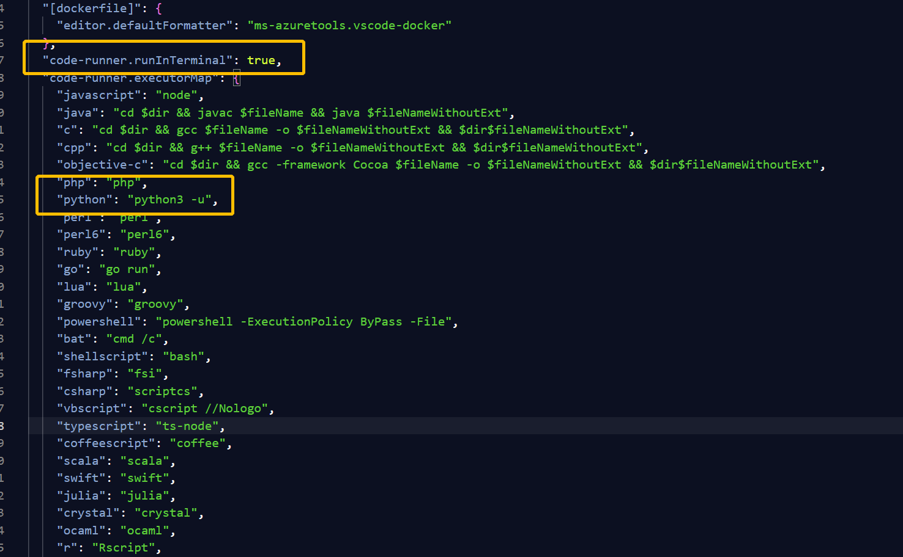

# VIDEO LOOM

<p align="center">
  
</p>

## User guide

> Before start using the software, be sure to have following softwares installed on your local machine.
>
> windows - `chocolatey` and `ffmpeg`
>
> mac - `ffmpeg`

### Windows

#### How to install `chocolatey` on windows

1. Open `powershell` on windows w/ administration access
2. In `powershell`, type `Set-ExecutionPolicy AllSigned` then click enter
3. Type this command

   ```st
   Set-ExecutionPolicy Bypass -Scope Process -Force; [System.Net.ServicePointManager]::SecurityProtocol = [System.Net.ServicePointManager]::SecurityProtocol -bor 3072; iex ((New-Object System.Net.WebClient).DownloadString('https://community.chocolatey.org/install.ps1'))
   ```

   and click enter

4. wait till the installation to complete

#### How to install `ffmpeg`

1. open `powershell` on windows w/ administration access
2. In `powershell`, type `choco install ffmpeg-full`, then click enter
3. wait till the installation process is complete
4. (optional) to verify `ffmpeg` is installed, reopen another `powershell` terminal and type `ffmpeg` and click enter. You should not see any error messages.

### Mac

#### How to install `ffmpeg`

1. in terminal. run `brew install ffmpeg`

### How to run the application

- download the .exe (windows) or .app (macOS) file
- open the application
- click on "Import files" button and start importing videos (up to 4)
  - 
- click on "Play all videos" and "Pause all videos" to play all video files simutaneously
  - use skip -5 / +5 buttons to skip backward and forward
  - (optional) if you want to play video with audio. Choose an audio track, then click on "generate preview" button under "Audio settings"
    - 
    - Wait till the application prompts you the preview generation is complete. Now when you play vidoes, you can hear the audio from the video simutenously
- In the text box, type in the segments of the videos you want to trim

  - e.g. If you'd like to use 0:00:00 - 0:10:00 from video 1, and 0:10:00 - 0:15:05 from video 2. Then the text would look like (as shown below):

  ```bash
  1,0:00:00,0:10:00
  2,0:10:00,0:15:05
  ```

  - 

- select the audio you would like to use for the final video
- then click "generate video" to start generating the final output. The output file will be in `.mp4` format and named after the current timestamp

## Environment setup (for developers)

### windows (WSL2)

1. In order to allow rendering in WSL2. We need to ensure Xming is installed.
2. Before starting development, launch application "XLaunch"
3. Follow below steps, for `Additional parameters for VcXsrv`, type `-ac`
   
   
   

4. After above steps, click `Finish` and launch Xming
5. Once Xming is launched, we'll need to configure the `$DISPLAY` variable to point to the local machine's IP. To do that, open a terminal and follow below steps:

```bash
$cat /etc/resolv.conf

# this is what you will see
# # This file was automatically generated by WSL. To stop automatic generation of this file, add the following entry to /etc/wsl.conf:
# # [network]
# # generateResolvConf = false
# nameserver 172.27.176.1

$export DISPLAY=172.27.176.1:0 # ensure :0 appended in the end
```

6. (optional) If you are running application using `code-runner` in `VSCode`. You can configure `"code-runner.runInTerminal": true` in `settings.json`. As well as setting `python` command as `python3 -m`. See below
   
   (If you are seeing errors related to `$DISPLAY`, make sure to run `export DISPLAY=172.27.176.1:0` in your VSCode terminal)
7. Now you can run `python3 <app_name>.py` to execute programs.

## Testing

> Ensure `pytest, freezegun` are installed

```bash
# install pytest
$pip3 install pytest freezegun
```

> Running tests

```bash
# running tests
$pytest -vv -s
```

## Packaging

> Ensure `pyinstaller` is installed

```bash
$pip3 install pyinstaller
```

> Generate executables (note: executables will automatically be determined by the OS. e.g. `.exe` for Windows and `.app` for MacOS)

```bash
$cd src
$./bundle.sh <app.win32.spec | app.macos.spec>
```

## Change log

> change logs can be found [here](changelog.md)
